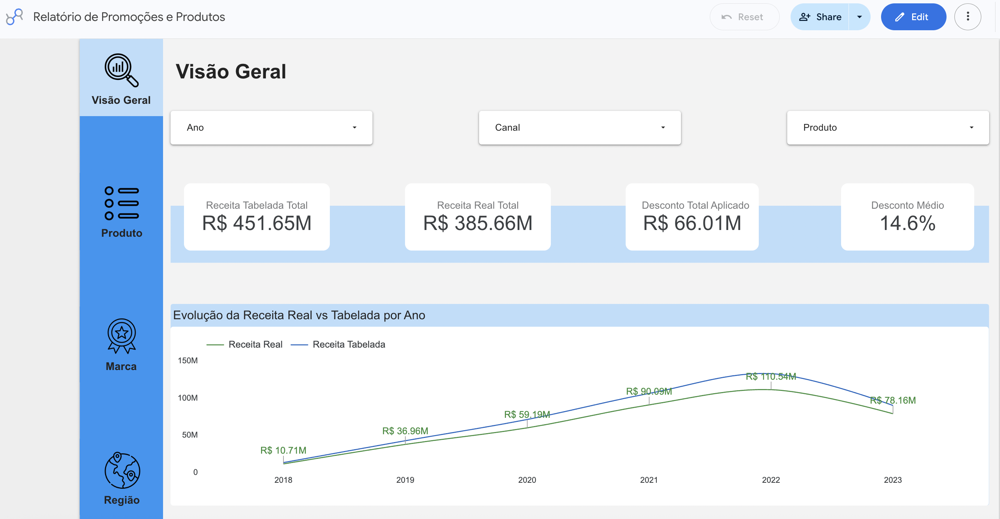

# 📊 Promoções & Produtos – Pipeline de ETL

## 🌐 Visão Geral
Este projeto implementa um pipeline de ETL (Extract, Transform, Load) utilizando Google Colab para tratar uma base de dados de produtos e promoções.

Os dados são limpos, transformados e carregados no Google BigQuery, servindo como base estruturada para análises e dashboards no Looker Studio.

⚠️ Observação: Este projeto foi desenvolvido como parte de um case técnico baseado em um cenário de negócio fictício.

---

## 🛠️ Tecnologias Utilizadas
- 🐍 Python (Google Colab)
- ☁️ Google BigQuery
- 📊 Looker Studio
- 📦 Pandas, NumPy, Matplotlib, Seaborn

---

## 📊 Dashboard Interativo
[](https://datastudio.google.com/s/oMKxxy-FiKo)

🔗 Clique na imagem acima ou acesse diretamente pelo link:  
[https://datastudio.google.com/s/oMKxxy-FiKo](https://datastudio.google.com/s/oMKxxy-FiKo)

--

## 📚 Dicionário de Dados

Este dicionário descreve a estrutura da base utilizada no pipeline de ETL.

| Coluna | Descrição |
|--------|----------|
| cod_ciclo | Ciclo do produto |
| cod_ano | Ano do ciclo |
| cod_canal | Canal de vendas |
| cod_agrupador_sap_material | Código do produto |
| cod_regional_agrupador | Código da região do produto |
| cod_uf | Estado |
| des_categoria_material | Categoria do produto |
| des_subcategoria_material | Subcategoria do produto |
| des_marca_material | Marca do produto |
| des_tier | Faixa de preço do produto |
| des_mecanica_consumidor | Descrição da promoção para o consumidor |
| des_mecanica_rev | Descrição da promoção para revendedora |
| des_promocao_publico | Público-alvo da promoção |
| vlr_desconto_real | Valor total de desconto aplicado |
| vlr_rbv_tabela_so_tt | Receita total tabelada |
| vlr_rbv_real_so_tt | Receita total real |
| vlr_preco_base | Preço unitário base (preço cheio) |
| vlr_preco_venda | Preço unitário praticado |
| vlr_preco_tabela | Preço unitário de tabela (preço cheio) |
| vlr_desconto_real2 | Valor de desconto aplicado por produto |

---

## 📥 Extração dos Dados
- Fonte: arquivo CSV (arquivo local do projeto)
- Leitura com `pandas.read_csv()`
- Registros: 19.502  
- Colunas: 20  

---

## 🧹 Transformações

### 🔹 Remoção de Duplicados
- 200 registros duplicados removidos  
- Dataset final: 19.302 linhas  

### 🔹 Tratamento de Nulos
- `vlr_desconto_real` e `vlr_desconto_real2`: preenchidos com mediana  
- `cod_ano`: derivado de `cod_ciclo`  

### 🔹 Ajuste de Tipos
- `cod_agrupador_sap_material`: float → string  

### 🔹 Variáveis Categóricas
- Nenhuma coluna com dominância >90%  

### 🔹 Outliers
- Detectados via método IQR  
- Mantidos por possível relevância de negócio  

---

## 📈 Análise Exploratória
- Estatísticas descritivas  
- Boxplots  
- Identificação de padrões de preço e desconto  

---

## ☁️ Carga no BigQuery
- Autenticação via service account  
- Schema definido explicitamente  
- Método: `WRITE_TRUNCATE`  

```python
job = client.load_table_from_dataframe(
    df_prom_prod, 
    table_ref, 
    job_config=job_config
)
```

---

## 🗺️ Resultado Final
- Dataset estruturado no BigQuery
- Pronto para consumo em BI
- Base confiável para análises

---

## ✅ Resultados
- Pipeline de ETL robusto
- Melhoria na qualidade dos dados
- Estrutura escalável para análises

---

## 📄 Apresentação de Negócio

Este projeto também inclui uma apresentação de negócios com insights e recomendações estratégicas.

📥 [Baixar Apresentação](./presentation_pt.pdf)

---

## 🚀 Próximos Passos
- Validação automatizada de dados
- Cargas incrementais
- Evolução do dashboard com KPIs de negócio